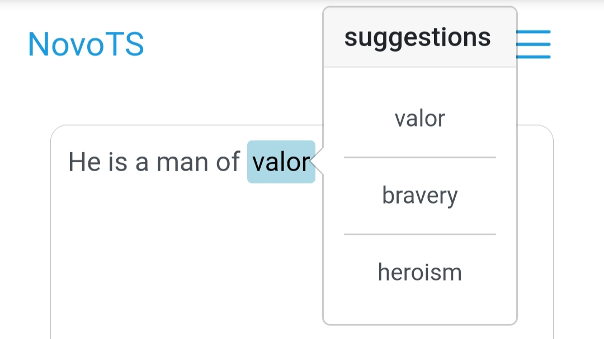

[![Contributors][contributors-shield]][contributors-url]
[![Forks][forks-shield]][forks-url]
[![Stargazers][stars-shield]][stars-url]
[![Issues][issues-shield]][issues-url]
[![LinkedIn][linkedin-shield]][linkedin-url]

<!-- PROJECT LOGO -->
<br />
<p align="center">
  <a href="https://github.com/Chrono4/NovoLS">
    
  </a>

  <h3 align="center">NovoLS</h3>

  <p align="center">
    An unsupervised text simplification system.
    <br />
    <a href="https://github.com/Chrono4/NovoLS"><strong>Explore the docs »</strong></a>
    <br />
    <br />
    <a href="https://github.com/Chrono4/NovoLS">View Demo</a>
    ·
    <a href="https://github.com/Chrono4/NovoLS/issues">Report Bug</a>
    ·
    <a href="https://github.com/Chrono4/NovoLS/issues">Request Feature</a>
  </p>
</p>

<!-- ABOUT THE PROJECT -->
## About The Project

NovoLS is a lexical text simplification system which I constructed as part of my dissertation project. It is largely insipired by LightLS — an older lexcial text simplifier proposed by Prof. Dr. Goran Glavaš and Dr. Sanja Štajner in 2015. Both NovoLS and LightLS make use of GloVe word embeddings to find ‬simplification candidates for complex words, which are then ranked on a number of different features.

### Prerequisites

* [Gensim](https://radimrehurek.com/gensim/)

* [NLTK](https://www.nltk.org/)

* [Wordfreq](https://pypi.org/project/wordfreq/)

### Installation

1. Install prerequisites if not already installed
```sh
pip install gensim nltk wordfreq
```

2. Clone the repo
```sh
git clone https://https://github.com/Chrono4/NovoLS.git
```

3. Run simplifier.py

<!-- ROADMAP -->
## Roadmap

See the [open issues](https://https://github.com/Chrono4/NovoLS/issues) for a list of proposed features (and known issues).

<!-- CONTACT -->
## Contact

If you have any questions or concerns, message me on [LinkedIn](https://www.linkedin.com/in/kane-miles-dev/) or email me at Kanemiles445@gmail.com.

<!-- ACKNOWLEDGEMENTS -->
## Acknowledgements

Shout out to Prof. Dr. Goran Glavaš for answering questions I had about the project. My dissertation would not have been what it was without his help. For those interested, a minimal version of Prof. Glavaš and Štajner's LightLS system can be found [here](https://github.com/codogogo/lightls)

<!-- MARKDOWN LINKS & IMAGES -->
<!-- https://www.markdownguide.org/basic-syntax/#reference-style-links -->
[contributors-shield]: https://img.shields.io/github/contributors/github_username/repo.svg?style=flat-square
[contributors-url]: https://github.com/Chrono4/NovoLS/graphs/contributors
[forks-shield]: https://img.shields.io/github/forks/github_username/repo.svg?style=flat-square
[forks-url]: https://github.com/Chrono4/NovoLS/network/members
[stars-shield]: https://img.shields.io/github/stars/github_username/repo.svg?style=flat-square
[stars-url]: https://github.com/Chrono4/NovoLS/stargazers
[issues-shield]: https://img.shields.io/github/issues/github_username/repo.svg?style=flat-square
[issues-url]: https://github.com/Chrono4/NovoLS/issues
[linkedin-shield]: https://img.shields.io/badge/-LinkedIn-black.svg?style=flat-square&logo=linkedin&colorB=555
[linkedin-url]: https://www.linkedin.com/in/kane-miles-dev/
